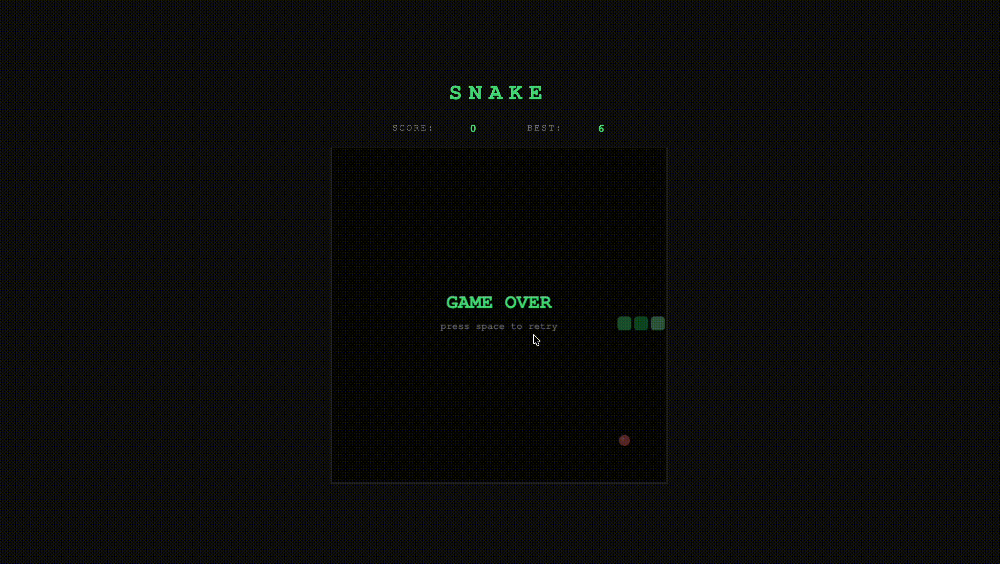

# 🐍 Snake Game



[](https://qlty.sh/gh/mariqzm/projects/snake-game)

Классическая игра Змейка на Vanilla JavaScript, HTML5 Canvas и CSS.

## 🎮 Играть

**[➡ Live Demo](https://mariqzm.github.io/snake-game/)**

## Стек

- HTML5 Canvas API
- Vanilla JavaScript (ES6+)
- CSS3

## Как запустить локально

```bash
git clone https://github.com/mariqzm/snake-game.git
cd snake-game
# открыть index.html в браузере
```

## Управление

| Клавиша | Действие |
|---------|----------|
| ↑ / W | Вверх |
| ↓ / S | Вниз |
| ← / A | Влево |
| → / D | Вправо |
| Пробел | Старт / Рестарт |

## Выбранный проект

[Build Snake using only JavaScript, HTML & CSS](https://www.freecodecamp.org/news/think-like-a-programmer-how-to-build-snake-using-only-javascript-html-and-css-7b1479c3339e/)

